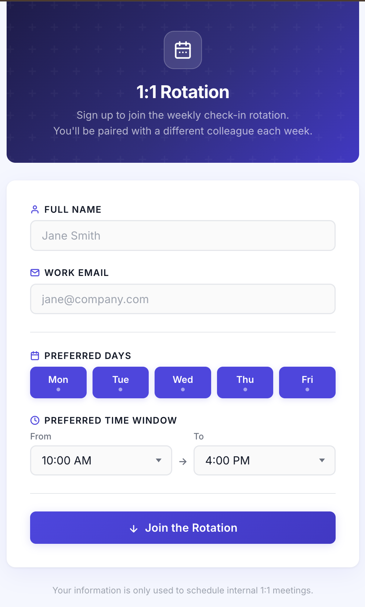

# 1:1 Rotation Scheduler — Google Apps Script

Automatically schedules weekly 1:1 meetings between colleagues using a **round-robin rotation**. Each run pairs everyone up differently. Over a full cycle, every person meets every other person exactly once.



---

## How the Rotation Works

With 4 colleagues A, B, C, D:

```
Round 1: A & B,  C & D
Round 2: A & D,  B & C
Round 3: A & C,  D & B
→ repeats from Round 1
```

- Each person gets **exactly one 1:1 per round**
- **Odd number of people?** One person sits out per round, rotating fairly
- The current round is remembered between runs and advances automatically
- Use **"Reset Rotation to Round 1"** from the menu to restart the cycle

---

## File Structure

```text
├── Code.gs             — Project index (comment only)
├── Config.gs           — All configuration constants
├── Menu.gs             — Custom spreadsheet menu
├── Pairings.gs         — Round-robin algorithm + round state
├── Scheduler.gs        — Main orchestration + cross-team pairing filter
├── CalendarService.gs  — Free/busy checks and event creation
├── SheetService.gs     — Sheet reads, writes, and setup (Participants + Teams + Log)
├── Triggers.gs         — Time-based trigger management
├── Utils.gs            — Date/time helpers
├── Webapp.gs           — Web app routing + sign-up + dashboard server functions
├── webapp.html         — Self-service sign-up form
└── dashboard.html      — Personal dashboard (preferences, upcoming 1:1s, leave/rejoin)
```

> All `.gs` files share the same global scope in Apps Script — no imports needed. Files are separated by responsibility only.

---

## Prerequisites

- A Google account with Google Calendar
- Google Sheets + Apps Script access
- Colleagues should be in the **same Google Workspace org** for accurate free/busy checking

---

## Setup (~15 minutes, one-time)

### Step 1 — Create a Google Sheet

Go to [sheets.google.com](https://sheets.google.com), create a blank spreadsheet, name it e.g. **"1:1 Scheduler"**.

---

### Step 2 — Open Apps Script

In your Sheet: **Extensions → Apps Script**

---

### Step 3 — Add All Script Files

For each `.gs` file in this project:
1. Click **"+"** next to Files → **Script**
2. Name it exactly as listed (e.g. `Config`, `Pairings`, `Scheduler`, etc.)
3. Paste the file contents

For `webapp.html`:
1. Click **"+"** → **HTML**
2. Name it `webapp`
3. Paste the contents

Replace the default content in `Code.gs` with the index comment from this project's `Code.gs`.

The Files panel should show all 10 files when done.

---

### Step 4 — Enable the Calendar Advanced Service

Required for checking free/busy times for both people in each pair.

1. In the Apps Script editor, click **Services** (`+` icon in left sidebar)
2. Find **Google Calendar API** → **Add**

> Without this, the script falls back to checking only the script owner's calendar.

---

### Step 5 — Configure (optional)

Open `Config.gs` and adjust as needed:

```javascript
const CFG = {
  durationMins:            25,  // meeting length in minutes
  scheduleMinDaysAhead:    7,   // never schedule sooner than this many days from now
  searchDaysAhead:         14,  // scan up to this many days ahead (window = 7–14 days)
  workStartHour:           10,  // default start hour (overridden by participant preferences)
  workEndHour:             16,  // default end hour   (overridden by participant preferences)
  slotIntervalMin:         30,  // scan every N minutes
  skipIfMeetingWithinDays: 14,  // skip pair if they already have a 1:1 within this window
  meetingTitle: "1:1 — {person1} & {person2}",
};
```

---

### Step 6 — Run First-Time Setup

In the Apps Script editor, select `setupSheetHeaders` → **Run**. Approve the authorization prompt.

This creates the **Participants** and **Schedule Log** sheets.

---

### Step 6.5 — Fill in the Teams sheet

After setup, open the **Teams** tab and replace the example entries with your actual team names (one per row, column A). These populate the team dropdown in both web pages.

---

### Step 7 — Add Colleagues (two ways)

#### Option A — Web App (recommended, self-service)

Two pages are served from the same deployment:

| URL | Purpose |
|---|---|
| `<deployment-url>` | Sign-up form — join the rotation |
| `<deployment-url>?page=dashboard` | Personal dashboard — view & edit preferences, see upcoming 1:1s |

1. **Deploy → New deployment**
2. Type: **Web app** | Execute as: **Me** | Access: **Anyone in your org**
3. Share the sign-up URL with your team and the `?page=dashboard` URL for managing preferences

On the **sign-up form**, colleagues fill in their name, preferred days/times, team, and whether they're open to cross-team meetings.

On the **dashboard**, they can:
- View and edit all their preferences
- See upcoming scheduled 1:1s (dates in Berlin time)
- Leave the rotation (deactivate) or rejoin at any time

> The dashboard uses Google login automatically — no password or email input needed.

> After any code change: **Deploy → Manage deployments → Edit → New version → Deploy**

#### Option B — Add directly to the sheet

Open the **Participants** tab and fill in rows:

| Name | Email | Active | Preferred Days | Preferred Start Hour | Preferred End Hour | Team | Cross Team Open |
|---|---|---|---|---|---|---|---|
| Alice | alice@co.com | ✅ | Mon,Tue,Wed,Thu,Fri | 10 | 16 | Engineering | ☐ |
| Bob | bob@co.com | ✅ | Mon,Wed,Fri | 9 | 15 | Product | ✅ |
| Carol | carol@co.com | ✅ | Tue,Thu | 10 | 17 | Engineering | ✅ |

- **Active**: uncheck to remove someone from the rotation without deleting them
- **Preferred Days**: comma-separated abbreviations — `Mon`, `Tue`, `Wed`, `Thu`, `Fri`
- **Preferred Start/End Hour**: 24-hour numbers (`10` = 10 AM, `16` = 4 PM)
- **Team**: must match a name from the **Teams** sheet exactly
- **Cross Team Open**: check to allow cross-team pairings (both people must have this checked)
- If Preferred Days/Hours are blank, the global `CFG` defaults are used

---

### Step 8 — Schedule

Reload your Sheet. Use the **"1:1 Scheduler"** menu:

| Menu Item | What it does |
|---|---|
| ▶ Schedule This Week's Pairs | Runs the current round and advances to next |
| 🔍 Check & Reschedule Cancelled | Detects cancelled/declined meetings and reschedules them |
| ⏰ Set Weekly Trigger (Mon 8 AM) | Automates scheduling every Monday at 8 AM |
| 🗑 Remove All Triggers | Turns off automation |
| 🔄 Reset Rotation to Round 1 | Restarts the cycle |
| 📋 Setup Sheet Headers | Creates sheets (safe to re-run) |

---

## How It Works

### Scheduling a round

```
1. Read active participants from the sheet
2. Generate all rounds using the round-robin algorithm
3. Look up the current round (stored in Script Properties)
4. For each pair in the current round:
     a. Do they already have a 1:1 within the next 14 days? → skip
     b. Find the intersection of their preferred days and hours
     c. Scan for a free slot 7–14 days from now where BOTH are available
     d. Create the Calendar event — both receive invites
     e. Log the result to the Schedule Log tab
5. Advance the round counter by 1
```

### Cancellation & reschedule check

```
1. Read the Schedule Log for upcoming meetings (status = "scheduled", date in future)
2. For each entry, look up the Calendar event by ID:
     - Event not found       → "cancelled" (organiser deleted it)
     - A guest RSVP'd "No"  → "declined"
     - Otherwise            → "ok", skip
3. For cancelled/declined pairs:
     a. Find both people in the active participants list
     b. Find a new free slot using their preferences
     c. Create a new Calendar event — both receive new invites
     d. Update the old log row status (e.g. "cancelled — rescheduled")
     e. Add a new log row for the rescheduled meeting
```

---

## Slot Finding (per pair)

When finding a meeting time for a pair, the script uses the **intersection** of their preferences:

- **Days**: only days both have marked as preferred
- **Start time**: the later of the two start hours
- **End time**: the earlier of the two end hours
- If no overlap exists, the global CFG defaults are used as fallback

---

## Schedule Log

Every run appends rows to the **Schedule Log** tab:

| Timestamp | Round | Pair | Person 1 Email | Person 2 Email | Scheduled Time | Event ID | Status |
|---|---|---|---|---|---|---|---|
| 2026-04-28 08:01 | 1 | Alice & Bob | alice@co.com | bob@co.com | Mon, Apr 28 at 10:00 AM | abc123 | scheduled |
| 2026-04-28 08:01 | 1 | Carol & Dave | carol@co.com | dave@co.com | — | — | no free slot found |

---

## Limitations

| Limitation | Detail |
|---|---|
| Free/busy accuracy | Calendar API only works within the same Google Workspace org. External participants fall back to checking the script owner's calendar only. |
| Cancellation detection | Only detects events deleted by the script owner (organiser). If a participant removes it from their own calendar, it's not detected. |
| Decline detection | Only detects explicit RSVP "No". "Maybe" or no response is treated as ok. |
| Manual 1:1s not detected | The skip check only detects events that have both people as guests and "1:1" in the title. |
| Participant changes mid-cycle | Adding/removing participants recalculates the rounds; the round index wraps with modulo, but pairing history may shift. |

---

## Troubleshooting

| Problem | Fix |
|---|---|
| Menu not showing | Reload the Sheet; or run `onOpen` from the Apps Script editor |
| "No free slot found" | Increase `searchDaysAhead` in `Config.gs`, or widen preferred hours |
| Free/busy not respected | Enable Google Calendar API (Step 4) |
| Auth error on first run | Re-run any function in the editor and approve permissions |
| Sheet not found | Run `setupSheetHeaders` from the editor |
| Web app not saving to sheet | Check that `setupSheetHeaders` was run and the sheet exists |
| Web app changes not live | Create a new deployment version |
| Wrong timezone | Sheet → **File → Settings → Time zone** |
| Want to restart the pairing cycle | Use **"Reset Rotation to Round 1"** from the menu |

---

## Notes

- The script runs as **whoever owns the Apps Script project**. They are the calendar event organiser — both pair members receive invites and show as required attendees.
- Re-running is safe — the skip check prevents double-booking a pair.
- All execution logs are in **Apps Script → Executions** (left sidebar).
